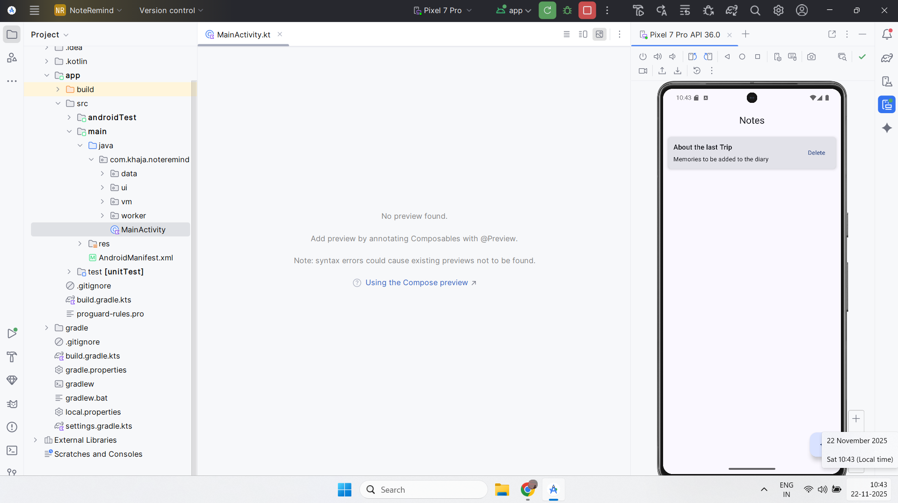
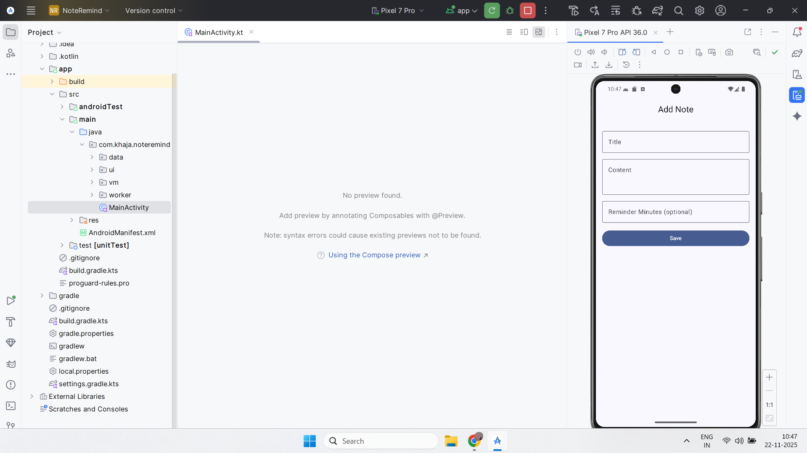
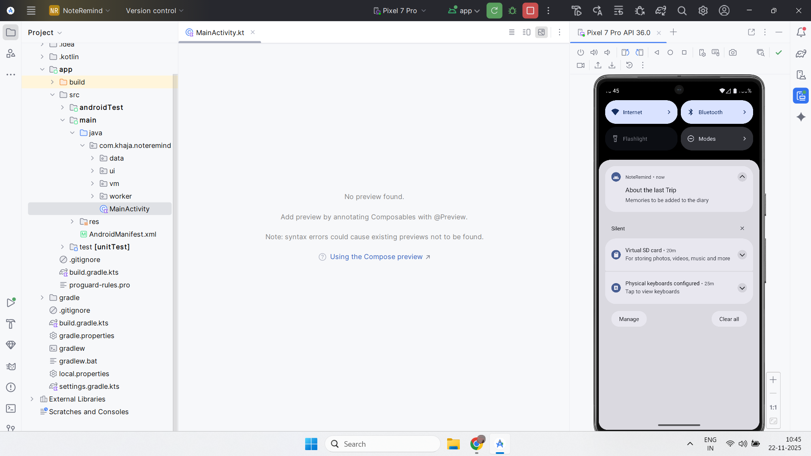

# 📘 NoteRemind  
A simple yet powerful Android note-taking application built using **Kotlin**, **Jetpack Compose**, **Room Database**, **WorkManager**, and clean **MVVM** architecture.

NoteRemind allows users to create notes, save them locally, and even schedule **timed reminders** that trigger Android notifications — perfect for beginners demonstrating real Android development skills.

---

## 🌟 Features

- 📝 **Create Notes** (Title + Content)
- 🔔 **Timed Reminders** using WorkManager
- 💾 **Local Storage** with Room
- 🎨 **Modern UI** with Jetpack Compose (Material 3)
- 🔄 **MVVM Architecture** with ViewModel + Repository
- 🗑 **Delete Notes**
- 📱 Works on Android 6.0+ and supports Android 13+ notification permissions

---

## 🛠️ Tech Stack

| Layer            | Technology |
|------------------|------------|
| Language         | Kotlin     |
| UI Toolkit       | Jetpack Compose (Material3) |
| Architecture     | MVVM + Repository |
| Local Storage    | Room Database |
| Background Tasks | WorkManager |
| Async Handling   | Coroutines |
| Navigation       | Navigation Compose |

---

## 🚀 How to Run

1. Clone the repository:  
   ```bash
   git clone https://github.com/khajashaikjalal/NoteRemind.git
2. Open in Android Studio.

3. Sync Gradle:
   File → Sync Project with Gradle Files

4. Run on an emulator/device.

5. Grant Notifications Permission (Android 13+).

6. Tap + to add a new note with optional reminder.

---

## 📸 Screenshots

| Notes List                | Add Note                 | Notification                      |
| ------------------------- | ------------------------ | --------------------------------- |
|  |  |  |

---

## 📂 Project Structure

com.khaja.noteremind
 ┣ data
 ┃ ┣ Note.kt
 ┃ ┣ NoteDao.kt
 ┃ ┣ NoteDatabase.kt
 ┃ ┗ NoteRepository.kt
 ┣ ui
 ┃ ┣ AddNoteScreen.kt
 ┃ ┣ NoteListScreen.kt
 ┃ ┗ AppNavHost.kt
 ┣ vm
 ┃ ┗ NoteViewModel.kt
 ┣ worker
 ┃ ┗ ReminderWorker.kt
 ┗ MainActivity.kt

---

## 🎯 Learning Goals Achieved

- Implemented MVVM architecture

- Designed UI entirely with Jetpack Compose

- Used StateFlow for reactive UI updates

- Implemented Room DAO, Database, Entities

- Scheduled background tasks with WorkManager

- Implemented Android 13+ Notification Permissions

- Clean, maintainable code for production-level workflow

---

## 📝 TODO / Future Improvements

- ✏️ Edit Note Screen

- 🔍 Search Notes

- 📌 Pin Important Notes

- 🌙 Dark Mode Enhancements

- 🔁 WorkManager Periodic Reminders

---

## 📄 License

This project is licensed under the MIT License.
See LICENSE for details.

---

## 🤝 Contributing

Feel free to fork this repo, open issues, or submit pull requests.
Happy coding! 🚀
